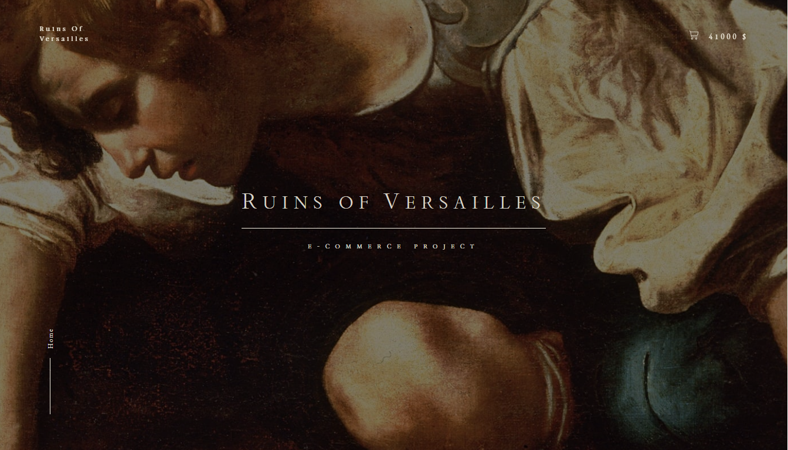
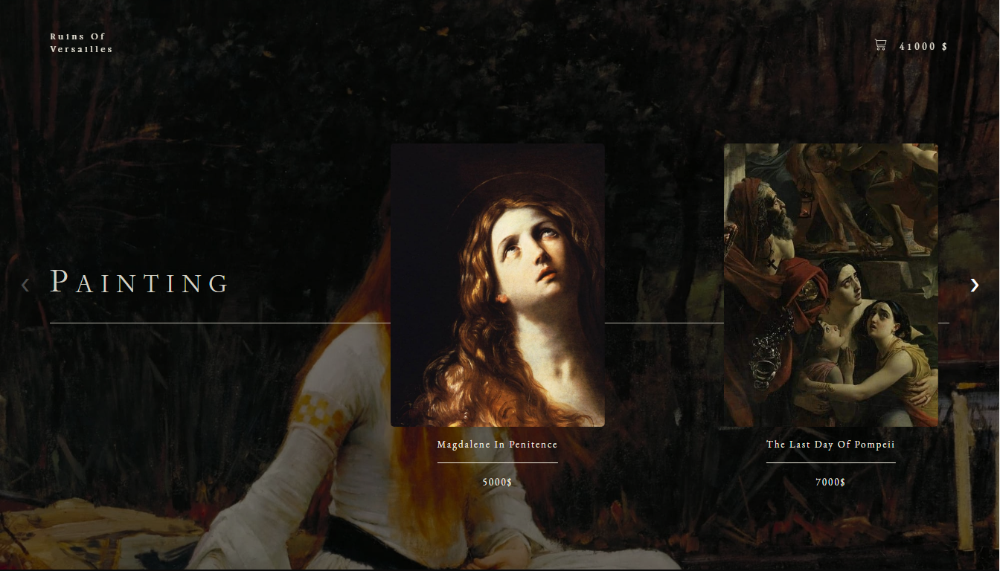
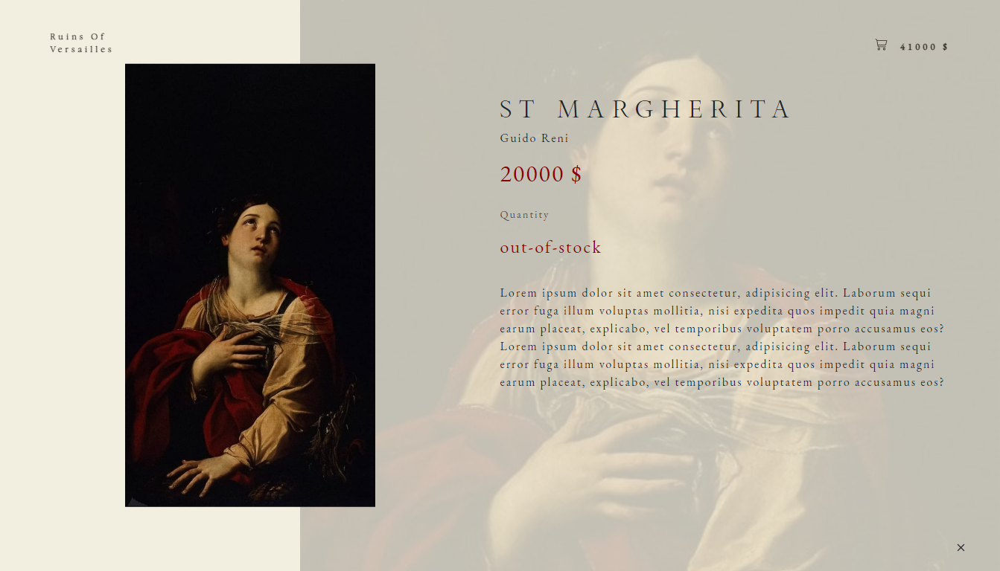
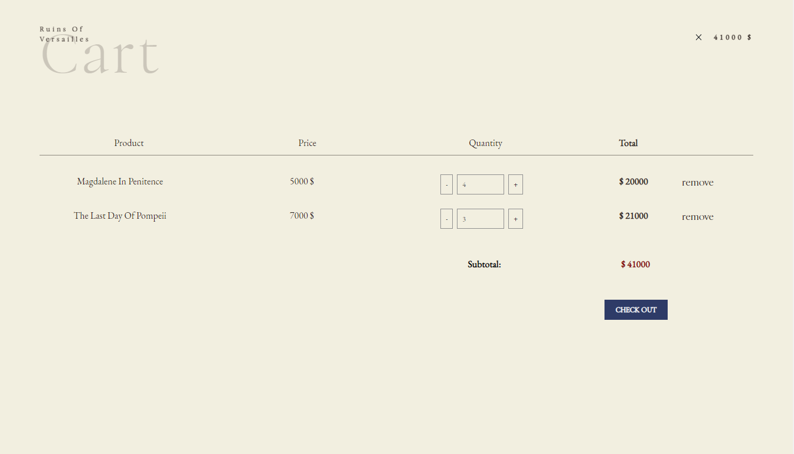
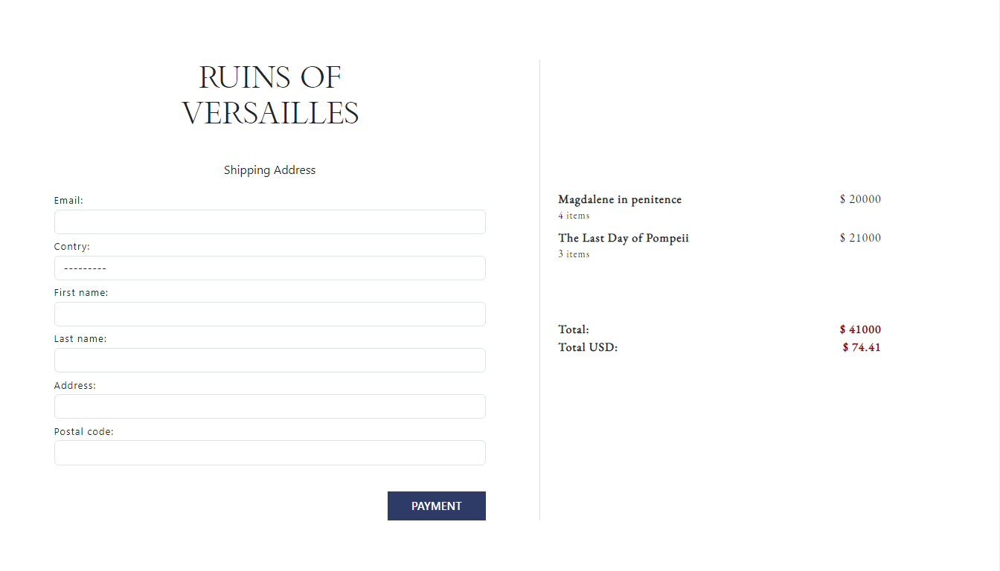

# Ruins Of Versailles | E-commerce Project

API that provides the functionality of an E-commerce about a paintings shop. 

The following endpoints are provided:    

- Register/Edit a product

- Delete a product  

- Consult a product  

- List all products  

- Update stock of a product  

- Register/Edit an order (including its details). Updating the stock of the product  

- Delete an order. Restore product stock  

- Consult order and details  

- List all orders     

# 💻 Languages, Frameworks, Libraries:

   
   

**View Project: [https://ruins-of-versailles-7rbc.onrender.com/](https://ruins-of-versailles-7rbc.onrender.com/)**

## Project Images: 

  

                                            
